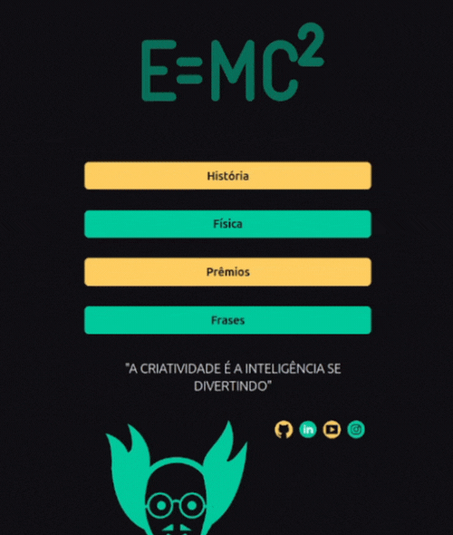

# Boas vindas ao My First LinkTree

## Introdução

Ou devo dizer... Einstein LinkTree?

<div align="center">
  
</div>

Bom, vejo muitas pessoas gostando de reunir links num mesmo lugar para ajudar na organização ou no próprio trabalho, como o que a plataforma LinkTree oferece de solução. Então, pensei... pq não oferecer uma solução dev para isso, sem precisar contratar um serviço? Foi aí que criei este repositório reservado para servir de modelo de aplicação e código para o desenvolvimento do seu prório LinkTree presonalizado! Você pode acessar o tutorial completo e mais detalhado de como o código foi feito no canal DudaTech -> [Com criar o seu próprio LinkTree? Next.js + Tailwind.css](https://www.youtube.com).

### As ferramentas principais utilizadas foram:


[Next](https://nextjs.org/)<br>
[Vercel](https://vercel.com/)<br>
[Tailwind.css](https://tailwindcss.com/)<br>

---

## Uso do projeto localmente

### Clone do repositório

Após cada um dos passos a seguir, haverá um exemplo do comando a ser digitado para fazer o que está sendo pedido, caso tenha dificuldades e o exemplo não seja suficiente, não hesite em me contatar em _eduardawiltiner@gmail.com_.

1. Abra o terminal e crie um diretório no local de sua preferência com o comando **mkdir**:
```javascript
  mkdir first-linktree
```

2. Entre no diretório que acabou de criar e depois clone o projeto:
```javascript
  cd first-linktree
  git clone https://github.com/dudawiltiner/my-first-linktree.git
```

### Instalação das dependências

3. Entre no diretório criado após a clonagem do repositório.
```javascript
  cd first-linktree
```

4. Instale todas as dependências, usando o CLI **npm**.
```javascript
  npm install
```
### Debug da aplicação

5. Abra no ambiente de desenvolvimento de sua preferência. No caso de uso do VSC, digite o comando **code .** na raiz do diretório clonado.
```javascript
  code .
```

4. Rode a aplicação com o node.js, usando o CLI **npm**.
```javascript
  npm run dev
```

## Link para o deploy da Plataforma:

https://einstein-linktree.vercel.app/

## Link para o tutrial n Youtube:

https://einstein-linktree.vercel.app/

